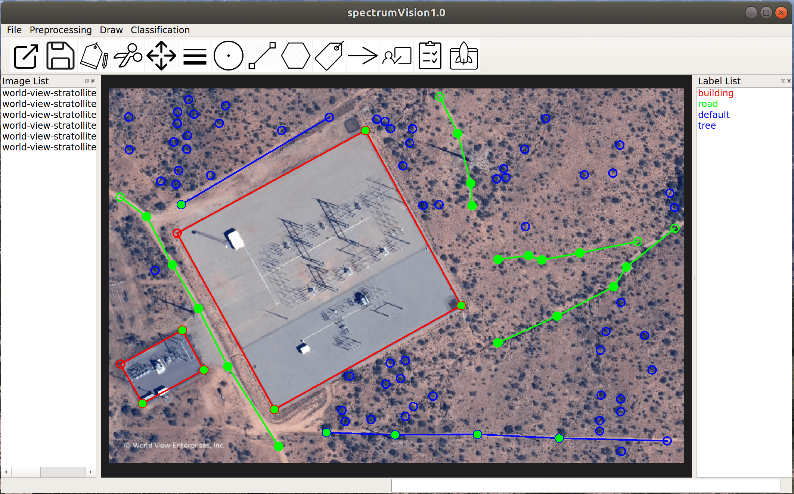

# SIP (smart image processing) 

Intelligent pixel-level image classification using deep neural networks.

# Features

* **Strong feature learning capability** of deep neural networks to capture weak signature information for accurate pixel-level classification and mapping.

* **Fast processing and mapping** of a large number of image scenes by leverating GPU computation;

* **Quickly drawing some examplar pixels** using lines, points and polygons on one scene gives you high-precision pixel-level label map of the whole scene;

* Quickly drawing some lines, points and polygons on mutiple scenes gives you **a robust classifer that generates accurate predictions on new images**; 

* Accurate pixel-level classification and mapping of **many hundreds or thousands large scenes** (e.g., 5k by 5k pixels) can be achived within a single day using **a single desktop with GPU**;

* **Safe and convenient** for research, industry or governmental usage where all the data and data processing is local, avoiding the troubles of uploading your data to the cloud.

* Runs on **multiple system settings**, e.g., loptop with/without GPU, desktop with/without GPU, server with/without GPU; 

* Runs on **multiple operational systems**, e.g., Linux, Windows, MacOS; 

* **Strong preprocessing functionalities** to support open source or commercial images, e.g., **Drone hyperspectral/multispectral image**, Sentinel-1/2/3, RADARSAT-1/2, **RADARSAT Constellation Mission (RCM)**, Landsat, MODIS, Drone images, and other **biomedical and industrial images**;

# Documentation
* [Installation](docs/installation.md)
* [First example - sea ice classification](docs/first_example.md)
* [Image preprocessing](docs/sentinel1_preprocessing.md)
* [Burned area detection from Landsat8 Images](docs/ba_landsat8.md)
* [Config file](docs/config_file.md)
<!---* [Getting started](docs/get-started.md)--->
<!---* [Introduction](intro.md)--->
<!---* [Parameters](parameters.md)--->
<!---* [How To](how-to.md)--->
<!---* [FAQ](faq.md)--->
<!---* [Related Websites](related-website.md)--->

